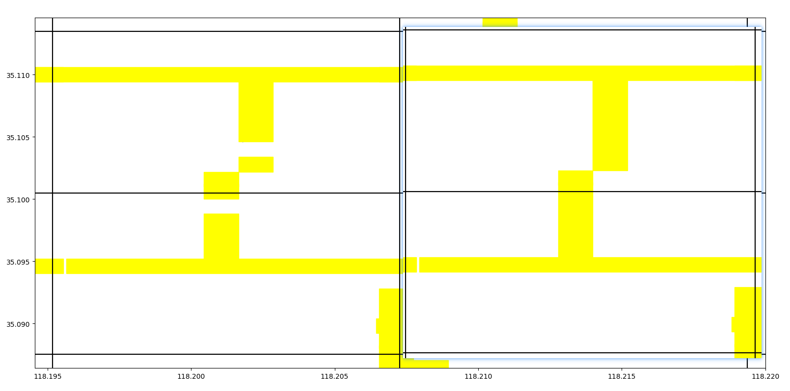
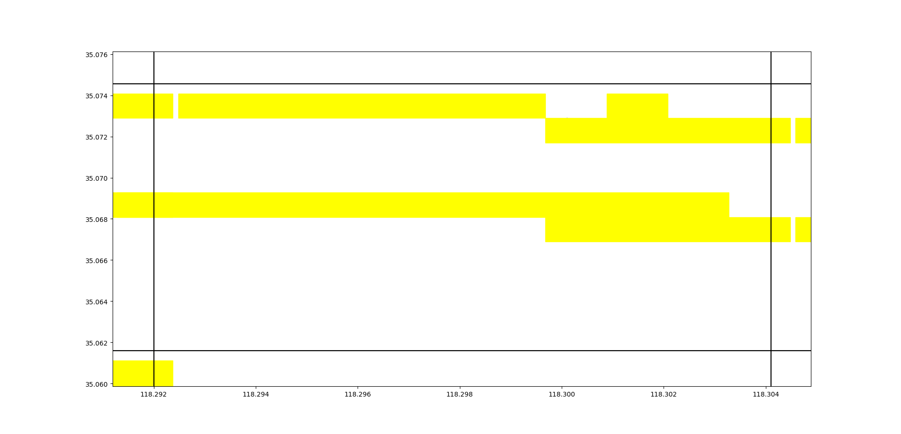
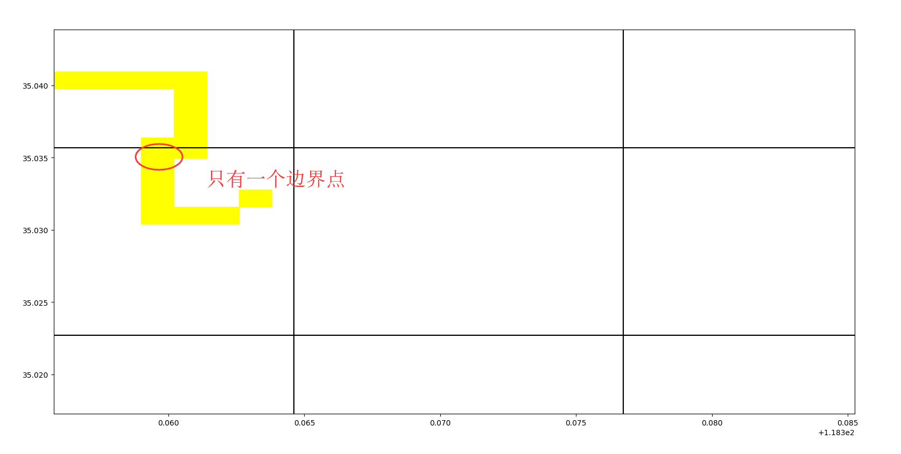
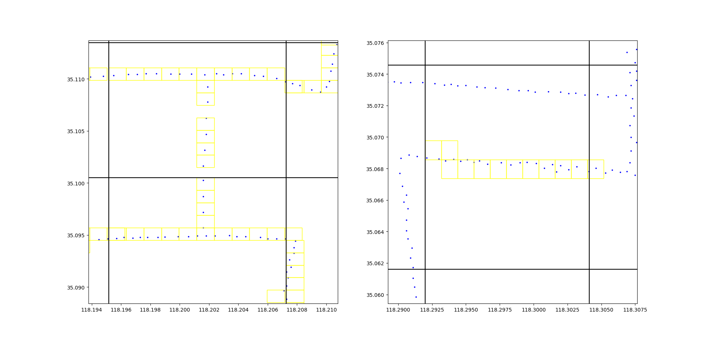
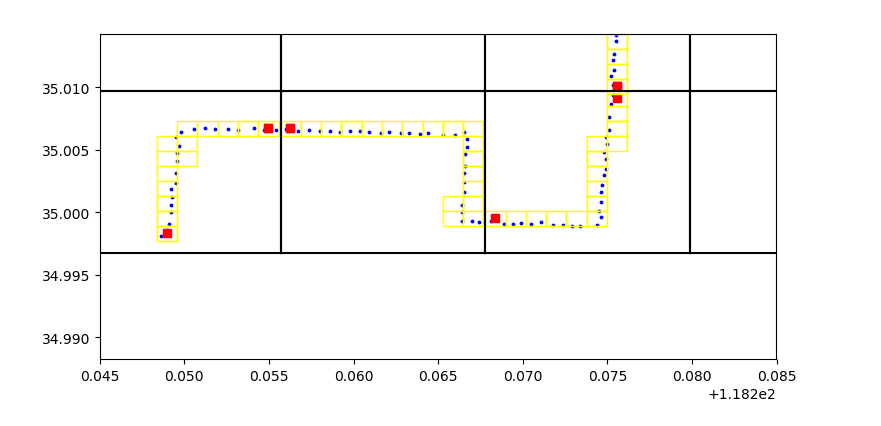
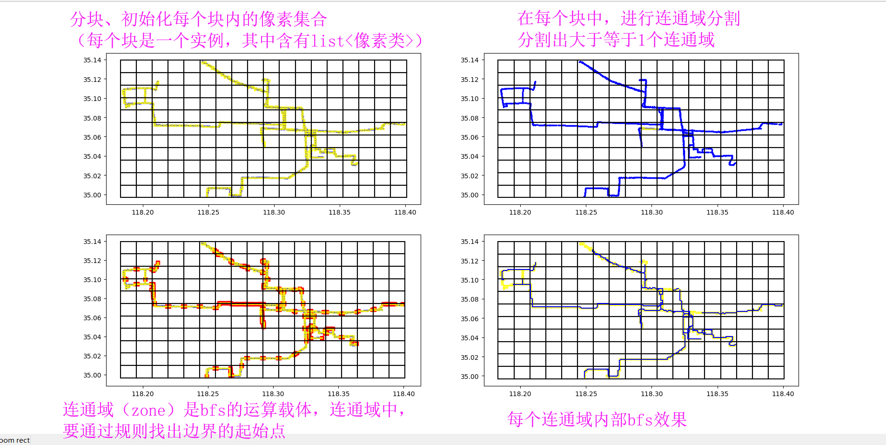

### 2019年9月8日11:32:53
- 完成了分块，开始对每一块使用“分像素，定起始终结点，BFS找连接关系，块与块间连接关系”算法

#### 分像素
- 首先观察每一块，找像素的最佳长宽，初步确定为0.001，像素类pixel
- 高0.0012，宽0.0012比较合适（pixelWidth = 0.0012，pixelHeight = 0.0012）
- 增加自我修复算法（对于一个块，如果其中的(x, y)位置像素为空，但是(x, y+-1单位)像素存在或者(x+-1单位, y)像素存在，则此像素也要设为存在）；**自我修复算法用于解决南北向（or东西向）直线道路GPS点过于稀疏的问题。**（rectangleWithPixel.fixMyPixels(self)）
- 自我修复算法效果非常好。

#### 定起始点

##### 首先分区
- 对于两处（或更多）不连通的区域，应分开讨论，因此设置成员变量zone = new list\<pixel\>()，zones = new list\<zone\>()
- 这个方法不对，应将zone定义成class。

##### 在一个zone内
- **插播一个问题：由于rectangle是存储在列表中的，因此rec之间无法体现位置关系。** 解决办法：用dict存储rec，为dict = {(row, line):rec}。这花费了很少的时间。
- **zone要包含的内容很多，因此将zone设为一个class，howManyZones(rectangle)返回本rec中的zone，zone为之后的运算单位**；（所有块的zone都存储在zones中）
- 下面是定边界点的思路：
1. 上下左右边界都可能存在边界像素，以左边为例；
2. 靠近左边的像素有哪些？记录到列表中，left_pixels。判断条件：离左边边线距离小于等于pixel().pixelWidth * 1.5。（最多空出一个pixel）
3. 现在已经有了边界点了，但是，如果一个zone只有一个边界点怎么办？见下图。

4. 则，寻找本zone中与现有zone最远的pixel为边界点。

####BFS连接关系
在一个zone内：
- 两种BFS函数：BFS(pixel，pixel)，BFS(pixel, pixelCollection)
- BFS运行完成后，两个集合更新：
1. pixelCollection，存储本zone内已经被确定连接关系的pixel
2. connectionCollection，存储连接关系[(pixel1, pixel2)]

###### zoneBFS()运行机制为
1. BFS(起始点1，起始点2)
2. while(还有起始点没用){
    if 起始点i已经在pixelCollection内: 跳过这个起始点i；
    else: BFS(起始点i, pixelCollection)
}

### 2019年9月9日08:33:50
做了一早上，在zone处卡住，效果总是不尽如人意。修改了pixel一些函数，如doIExist()。

### 2019年9月9日09:36:30
原来是while间的判断bool变量放错了位置。一直在纠结距离的计算。
如图，zone效果很好，但是存在一个问题，就是fix没有原来好用了，但是也有作用。

修改了fit的判断条件，又好使了。

### 开始做zone的定边界部分
- 为zone增加函数generateStarter()
- 1.5倍的pixelWidth()太大了，改为0.5。
- 同时，修改了zone内没有starter的规则：如果一个starter都没有，那么找一个离边界最近的。有了一个，在通过“只有一个starter”规则，找一个离本starter最远的，作为第二个starter。
- 结果很好。

### 下面开始做根据zone连接部分
- 为了便于管理，将BFS算法的函数封装在一个单独的类中，且都为静态方法。
- bfs的过程主要参考资料有：[python实现（队列的使用）](https://blog.csdn.net/wry2008wry/article/details/80696298),[本视频后半部分](https://www.bilibili.com/video/av60469427)。
- bfs思路：遍历时存储连接关系{(1,2), (1,3), (3,4), (3,6)}等；如果遍历到ender点（或者说触发end条件），停止bfs算法，从(*,ender)开始往回记录连接关系（connectionCollection），并记录用过点（pixelCollection）。
- pixelCollection用处：
- - 如果其他起始点已经在pixelCollection里，则跳过此起始点。
- - bfsP2P()、bfsP2Z()中，用于停止条件的判断。

- debug很久，最后发现循环变量zone_少了个“_”，于是python认为它是main()中变量，服气。函数内随意引用全局变量，还不报错。

- 很多边界没有起始像素，因此将生成起始点的阈值从0.5升高到0.75。

- 升高到0.85。

